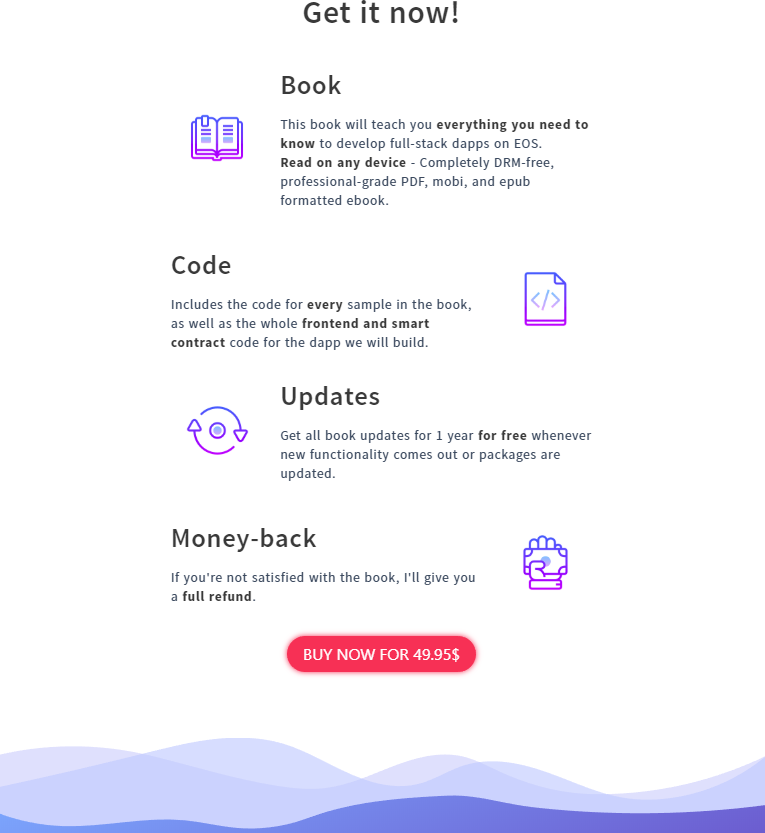
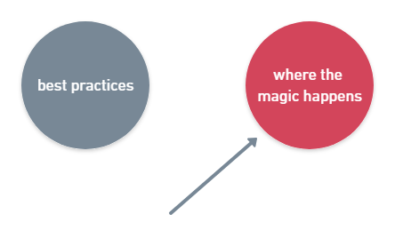

I'm writing a book on [EOS development](https://eos.io) that contains everything one needs to know about full-stack EOS blockchain development.
And, as you know, every ebook or video course needs a nice landing page.
This gave me the opportunity to play with some new technologies that I always wanted to try. 😄

Instead of using my bread and butter UI library, React, I used [Vue.js](https://vuejs.org/) and [BulmaCSS](https://bulma.io/) for styling the landing page.
The result can be seen on [learneos](https://learneos.dev).



## How did I do it?

### Vuejs with Nuxt
I used [nuxt](https://nuxtjs.org), which is a starter template for isomorphic Vue.js apps that comes with integrated routing, server-side rendering, state store (Vuex) and many other useful features.
It's like [zeit's next](https://github.com/zeit/next.js/) or `create-react-app` for React.
And I love it. For me, it was a lot more stable than `next` and includes more useful features and is easier to customize than `create-react-app`.

* Everything just worked. I wanted to use `SCSS` instead of normal CSS, and I only had to `npm install node-sass sass-loader` and their `vue-loader` somehow made it work without me needing to change the webpack config. 🤷🏻‍
* As with Vue, the `nuxt` documentation is great and contains infos on how to
    * Insert `meta` tags into the head
    * Use google analytics on the client-side
    * Add static `scss`/`css` files from third-party vendors (`Bulma`)
* I really like that it's so opinionated. It already has the entire folder structure set up for you to immediately get started.
* Easy to generate a static page that can be deployed to a static-site hoster like [netlify](https://netlify.com).

Two things that didn't immediately work with `nuxt`:
* Scrolling to `#section`s on the same page when clicking on an `a` tag. It's probably a bug in their router. I used the fix described in [this issue](https://github.com/nuxt/nuxt.js/issues/2738).
* I'm using [Single File Components](https://vuejs.org/v2/guide/single-file-components.html) (a single file containing the HTML, JavaScript, and CSS of the component) and VSCode cannot prettify the HTML markup with my `eslint-prettier` integration. I have to further investigate this. It was fixed when running `eslint --fix` in the command line, however.

I 'll definitely use `nuxt` again.

### Styling with Bulma
I used [Bulma](https://bulma.io) for styling. It's the first time I use an existing modern CSS framework. Usually, I end up writing all CSS from scratch because the layout never ends up how I want it to be with these frameworks.
I'm a bit torn about Bulma. On one side, it was definitely faster than implementing the CSS for the _Hero_, _Modal_, and _column_ system myself.
On the other side, I first had to learn its CSS classes which can sometimes be a bit ... _wordy_. (I'm looking at you `has-text-weight-light`.)
**The biggest pain point was the documentation.** It's **not searchable**, so you end up clicking around the sections and hope to find the CSS modifiers you want.
Is it in [`Syntax` or `Helpers`](https://bulma.io/documentation/modifiers/syntax/)?

> What the fuck is a _Syntax_ category anyway?

Some classes are also not documented at all, I could only find these CSS classes through [related GitHub issues](https://github.com/jgthms/bulma/issues/1526).

On a good note, I didn't encounter any CSS quirks and the CSS worked as expected.

### Custom components
There are some UI components on the landing page that I had to write myself.

The most interesting one was the **email modal with the signup form**:
It can be triggered from four different places, but it is always the same modal.
I didn't want to include the modal four times in the different sections and add a local show/hide state in each of these Vue.js sections.
Instead, I wrote a **global Vue plugin** that injects a `showModal` function into every Vue component. 



Another component is the CTA-button. I made it **glow** with a CSS transition:

```css
@keyframes glow-button-glow {
    from {
        background-color: $cta-color;
        box-shadow: 0 0 9px $cta-color;
    }
    50% {
        background-color: darken($cta-color, 10%);
        box-shadow: 0 0 18px darken($cta-color, 10%);
    }
    to {
        background-color: $cta-color;
        box-shadow: 0 0 9px $cta-color;
    }
}
```


If this doesn't make you click that button, I don't know what does.

## Design
I'm quite proud of the design. I'm not ashamed to admit that I stole many ideas from other landing pages. In the end, most sales/landing pages have the same structure and every creative process comes down to remixing existing ideas.

### Book cover
One of these things is the 3D book cover from [psdcovers](https://psdcovers.com) that everyone seems to be using.


The design of the logo happened **totally by accident**. I have a 3D render of the EOS logo from one of my other projects.
I played around with it in Blender, pulling several sliders and suddenly I had this cover that I liked.
It's one of these occasions where it pays off to have taken some course in computer graphics.
You have a rough understanding of the different Material types (Diffuse, Glossy, Glass) and light settings (ambient occlusion).
Then you play around and with the [super important immediate feedback](https://vimeo.com/36579366) you get to a result that you like. 

### Divider
Having hard edges from section to section doesn't look appealing. For the footer of the page, I designed an `SVG` consisting of two closed, filled curves overlaying each other.
This gives the footer section a nice effect.


## Deployment
As always, I deploy to [netlify](https://netlify.com) on every `git push`.
I also let them manage my DNS - you get HTTPS for free without needing to renew it yourself.
You just have to specify the build command and the output directory, which is `generate` and `dist` for `nuxt`.

## Summary
Using Vue.js with `nuxt` is great to build a static landing page. I had no prior experience with Vue and I could pick it up relatively fast. I love single-file components. 😍
I didn't use any Vue component library, HTML with Bulma's CSS and a couple custom components was enough.
Here's the [resulting landing page](https://learneos.dev). If you want to learn about blockchain development and smart contracts, feel free to sign up.
