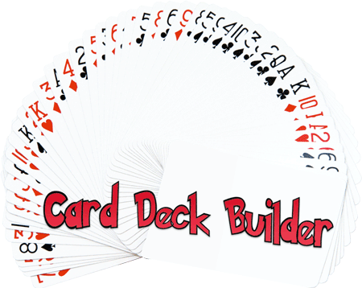

GraphQL is a new way to query data that avoids over-/under-fetching. Unlike REST, it has a single end-point to which you query by specifying only the data you actually need.
[Relay](https://facebook.github.io/relay/) is the canonical way to use GraphQL with React and I played around with it a bit - basically I followed [learnrelay's PokeDex Tutorial](https://www.learnrelay.org/). 
You can see my end result, [Card Deck Builder](https://github.com/MrToph/deck-builder), on GitHub.

The tutorial gives a good overview of the main Relay concepts, and I have a vague concept of how to apply it, but I feel like going into depth more instead of covering all topics would have helped.
For me it abstracted away too much and didn't talk about what part of the Relay container is passed as props to the component, what props `react-router-relay` injects, etc. A quick overview of how the GraphQL _backend_ is structured for the specific app would clarify a lot of issues.

Also I don't know how to use Relay in bigger apps or if I should even do it. It makes sense co-locating the component and the data it needs to render, but what if my component cannot be perfectly isolated and needs other parts of the state? Should I even have client-side only state or is it better to store _everything_ on the server side, allowing to query everything with Relay? Can I just hook up a `redux` store on top of the Relay containers? ...

I 'll take a step back and remove the Relay abstraction by starting out by just looking at [GraphQL and Redux](https://medium.com/@thisbejim/getting-started-with-redux-and-graphql-8384b3b25c56#.cc9hyy2ch).
Probably then, Relay makes more sense as I see the problems it is trying to solve and hopefully the "simpler, faster, and more predictable" [Relay v2](https://github.com/facebook/relay/issues/1369) has been released 👍.
